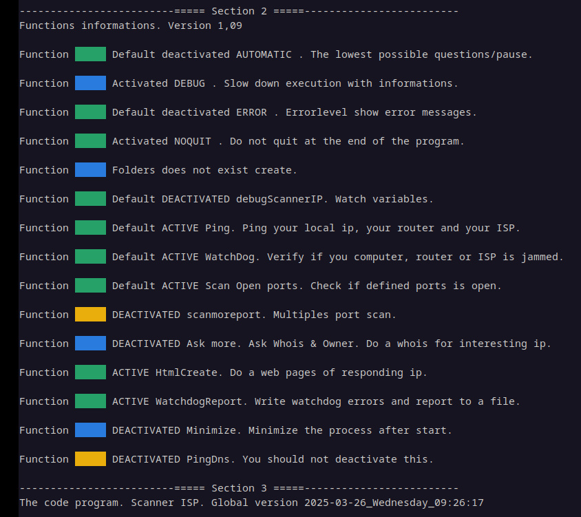

# LBS ScannerIP

	# Scan & test ALL IP with some ports from internet.
	
	Tested in Debian cinnamon 12 & 13. (Bash needed) Version 6.00 first public release.

	https://github.com/LostByteSoft
	LostBytesSoft, lost byte softwares, because everything is ephemeral.
	
	Scan IP network for responding ip and test open port.
	
	NOT answering devices will NOT shown.
	
	When responding ip found scan with theses port:
	If address found scan port : 20, 21, 80, 443, 8008, 8080
	If address found and scanmoreports=1 : 20, 21, 22, 23, 53, 69, 80, 443, 981, 989, 1194, 1337, 5001, 6969, 8080, 8008, 8087, 8888, 31337
	
	https://en.wikipedia.org/wiki/List_of_TCP_and_UDP_port_numbers
	
	Max ip adress : 256.256.256.256 = 4 294 967 296  addresses
	256*256*256*256= 4M (the 0 count and 255 is special and count)
	IPv4 uses a 32-bit address space which provides 4 294 967 296 unique addresses.
	592 708 864 are reserved so 3 702 258 432 are usable on direct internet.
	Ports are unsigned 16-bit integers (0-65535)	

	
	Don't hack paid software, free software exists and does the job better.
	
	1.0.0.0 to 2.0.0.0 = 16 777 216 address

What do you need to run this software:
--------------------------------------------------------------------
A computer with linux who can run bash.

	Any cpu, ram (1.1 mb for each scan) & hdd (100 mb).

	Some tools are not needed but recommended.
		Curl
		Ftp
		Filezilla
		Whois
		Xclip
		Xdotool
	

How to:
--------------------------------------------------------------------

	There are 256 files named ScanIP_WAN_V_*version*-X.0.0.0-X.0.0.0.sh
	
	The first one and the last one:
	ScanIP_WAN_V_202503252134-0.0.0.0-1.0.0.0.sh
	...
	ScanIP_WAN_V_202503252134-255.0.0.0-256.0.0.0.sh
	
	Just execute each .sh files (Suggest no more than 10 at the same time)

	If your computer fail or shutdown, just restart ScanIP_WAN_V_*version*-X.0.0.0-X.0.0.0.sh
	they will continue at last WatchDog. Press alt+c to friendly quit.
	
Others files:

ScanIP TEST ALL port specific ip.sh
	-Specify an ip ex:192.168.0.1 and scan all port 0 to 65535.

ScanIP TEST ip ftp anonymous.sh
	-Test an specified ip if port 21 (ftp) is open to anonymous.

ScanIP TEST port specific ip.sh
	-Specify an ip ex:192.168.0.1 and scan theses port:
	20, 21, 22,, 23, 69, 80, 443, 981, 989, 1194, 5001, 8080, 8081, 8008, 8888, 31337

bo2k1-3_beta5_bin.zip
	-BackOrifice2000

index.html
ScannerHTML.htm
ScannerLOGS.htm
	-Web style interface

ScanERRORS.txt
	-WatchDog report

Scanning takes a LONG time.... wait... wait again... and open : /ScannerHTML.htm
	ScanHTML-20.169.htm mean ScanHTML-20.169.XXX.XXX.htm

View windows:
--------------------------------------------------------------------

Mini program scanner windows size is optimized for 1920x1080 , that equal 8 windows of ScannerIP at the same time.

Options:
--------------------------------------------------------------------

There are many options: (on each .sh file started on line 57)

	watchdog , 0 or 1 , 0 deactivated , 1 activated , default 1
	scanmoreport , 0 or 1 , 0 deactivated , 1 activated , default 0
	askmore , 0 or 1 , 0 deactivated , 1 activated , default 1
	pingdns , 0 or 1 , 0 deactivated , 1 activated , default 1
	htmlcreate , 0 or 1 , 0 deactivated , 1 activated , default 1
	watchdogreport , 0 or 1 , 0 deactivated , 1 activated , default 1
	minimize , 0 or 1 , 0 deactivated , 1 activated , default 0

Logs:
--------------------------------------------------------------------

Errors report is saved in the ../ directory

Everything else is saved in folder :

Logs are going to /ScanLOGS folder./ScanLOGS/ScanLOGS-X.txt
Ftp are going to /ScanFTP folder. ScanFTP/ScanFTP-X.sh
Http are going to /ScanHTTP folder. ScanHTTP/ScanHTTP-X.sh
Extra are going to /ScanEXTRA folder. ScanEXTRA/ScanEXTRA-X.txt
Html are going to /ScanHTML folder. ScanHTML/ScanHTML-X.htm

Reserved address:
--------------------------------------------------------------------

There alot of ip address not used & reserved. View this site for more informations: https://en.wikipedia.org/wiki/Reserved_IP_addresses
There are no interest a scanning theses ip, but this program scan it anyway.

0.0.0.0–0.255.255.255		Reserved

...

Everything upper 240.0.0.0 is reserved or not used.

240.0.0.0–255.255.255.254 	Internet	Reserved for future use (former Class E network)
255.255.255.255			Subnet		Reserved for the limited broadcast destination address

Ftp:
--------------------------------------------------------------------

https://files.digilent.com/reference%2FEnabling_Access_to_FTP_Sites.pdf

BackOrifice2k:
--------------------------------------------------------------------

You can try bo2k1-3_beta5_bin.zip (BackOrifice2k) to connect with port 31337.

Donload https://sourceforge.net/projects/boxp/

ScannerIP v6:
--------------------------------------------------------------------

Scan ipv6 with "ScannerIPv6-1,13.sh", only random actually. Just start many instances to scan more.

Screenshot:
--------------------------------------------------------------------

All files in :

Functions informations

One ScannerIP

In resolution 1366x768 (6 scan)

In resolution 1920x1080 (8 scan)

Not included:
--------------------------------------------------------------------

I use a bash compiler to create 'ScannerHTML.htm' , 'ScannerLOGS.htm' & all 'ScanIP_WAN_V_202VERSIONS-X.0.0.0-X.0.0.0.sh'
	Theses compilers are NOT included.

Versions:
--------------------------------------------------------------------

ScannerIP v6,00 - 2025 - Fitst public release 

ScannerIP v5,75 - 2025-04-09-17-56-09
ScannerIP v5,72 - 2025-04-08-13-27-35
ScannerIP v5,59 - 2025-03-30 Sunday 19:50:28
ScannerIP v5,35 - version 2025-03-25
ScannerIP v0,01 - January 2025

FAQ:
--------------------------------------------------------------------
Why use bash there are best options out there ?
	I wanted to use bash.

What is the purpose of this ?
	Scnning all ip to find web sites.
	Finding hiding stuff.
	Personnal project.

End-user license agreement (eula)
--------------------------------------------------------------------

 	JUST DO WHAT THE F*** YOU WANT WITH THE PUBLIC LICENSE
 	
 	Version 3.1415926532 (January 2022)
 	
 	TERMS AND CONDITIONS FOR COPYING, DISTRIBUTION AND MODIFICATION
    	
	Everyone is permitted to copy and distribute verbatim or modified copies of
 	this license document.
 	
 	As is customary and in compliance with current global and interplanetary
 	regulations, the author of these pages disclaims all liability for the
 	consequences of the advice given here, in particular in the event of partial
 	or total destruction of the material, Loss of rights to the manufacturer
 	warranty, electrocution, drowning, divorce, civil war, the effects of radiation
 	due to atomic fission, unexpected tax recalls or encounters with
 	extraterrestrial beings elsewhere.
 	
 	YOU MUST ACCEPT THESES TERMS OR NOTHING WILL HAPPEN.
 	
 	LostByteSoft no copyright or copyleft we are in the center.
 	
 	You can send your request and your Christmas wishes to this address:
 	
 		Père Noël
 		Pôle Nord, Canada
 		H0H 0H0

--------------------------------------------------------------------
